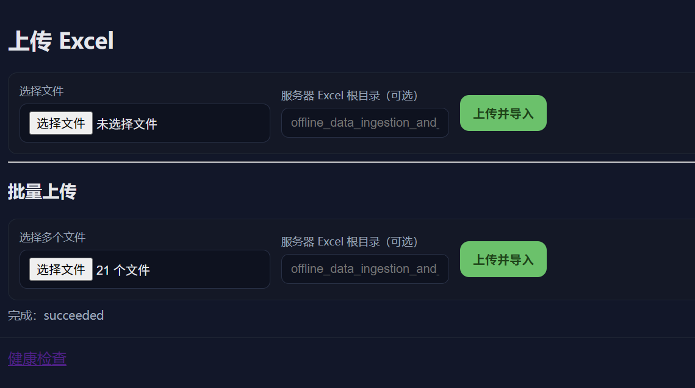
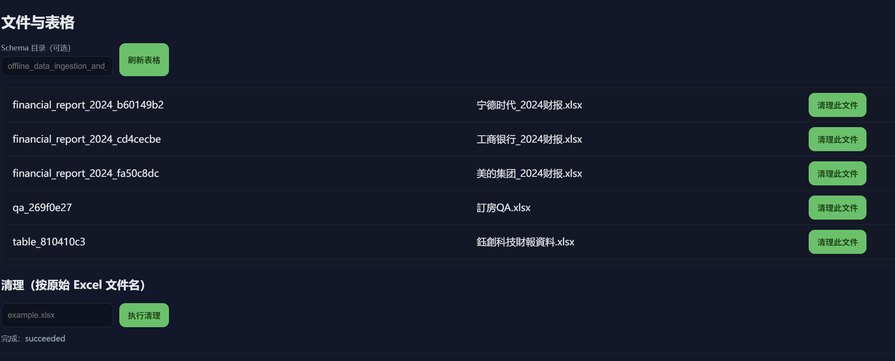
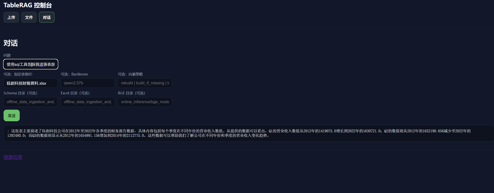
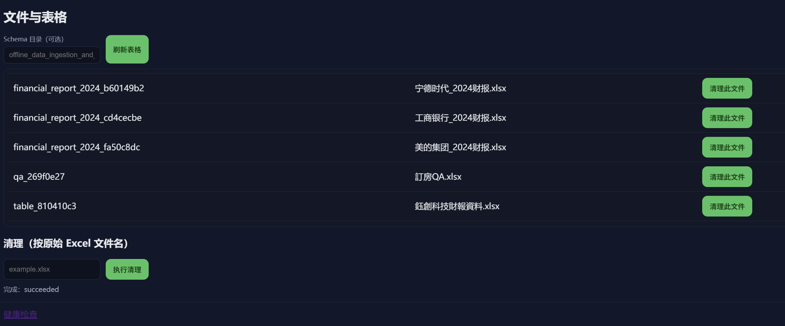
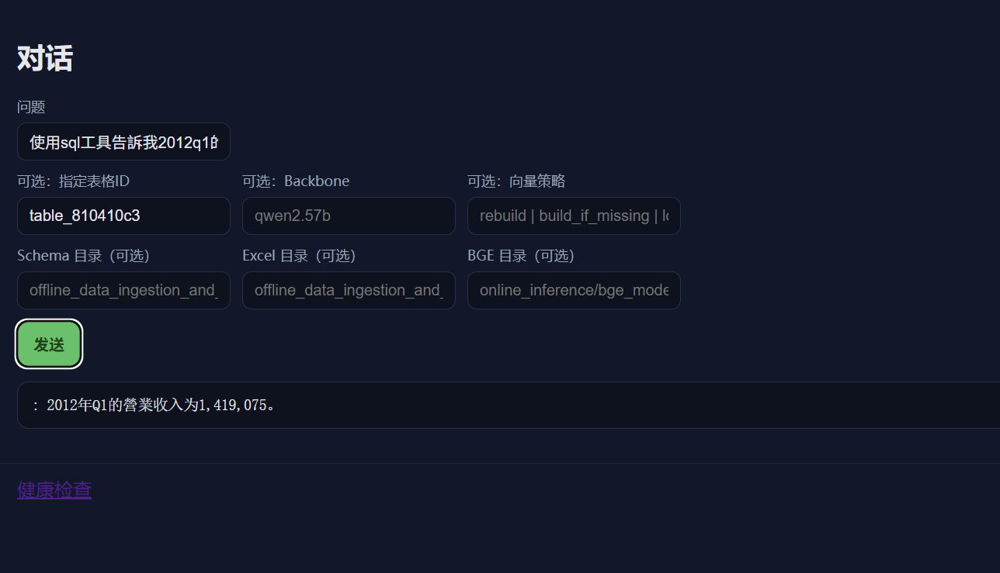

## 使用 Docker 快速部署

- **前置需求**
  - 安裝 Docker Desktop（建議啟用 WSL2 效能最佳）。
  - 確保連接埠可用：8000（FastAPI）、5000（Flask/SQL）、3306（MySQL）、11434（Ollama）、8001（vLLM，選用）。
### BGE 模型下載與放置
為避免將大型權重提交到 Git，`online_inference/bge_models/` 已被忽略。請依下列方式下載並放置：

```powershell
# 建議使用 huggingface-cli（可從 pip 安裝）
pip install -U "huggingface_hub[cli]"

# 建立模型目錄（如 bge-m3 與 reranker）
mkdir -Force online_inference\bge_models\bge-m3
mkdir -Force online_inference\bge_models\bge-reranker-v2-m3

# 下載 BGE-M3（向量與多語嵌入）
huggingface-cli download BAAI/bge-m3 --local-dir online_inference/bge_models/bge-m3 --local-dir-use-symlinks False

# 下載 BGE Reranker v2 M3（重排序模型）
huggingface-cli download BAAI/bge-reranker-v2-m3 --local-dir online_inference/bge_models/bge-reranker-v2-m3 --local-dir-use-symlinks False
```

- **一鍵啟動**（於專案根目錄）
```powershell
docker compose -f path\to\TableRAG-main\docker-compose.yml up -d --build
```

- **第一次使用，拉取 LLM 模型（Ollama 容器內）**
```powershell
docker exec -it tablerag_ollama ollama pull qwen2.5:7b
```

- **驗證服務**
  - 健康檢查：`http://localhost:8000/health`
  - API 文件：`http://localhost:8000/docs`
  - SQL 服務（POST）：`http://localhost:5000/get_tablerag_response`
  - Ollama 狀態：`http://localhost:11434/api/tags`
  - vLLM 狀態（OpenAI 相容）：`http://localhost:8001/v1/models`

### API 文檔閱讀

- Swagger UI：`http://localhost:8000/docs`


- **更新與測試變更**
  - 只改了程式碼（.py / 模板 / 靜態檔）：通常 FastAPI 會熱重載，如未生效可重啟應用容器：
    ```powershell
    docker compose restart app
    ```
  - 變更了 `requirements.txt` 或 `Dockerfile`（需重建鏡像）：
    ```powershell
    # 一般增量重建
    docker compose up -d --build app

    # 需要完全不走快取時
    docker compose build --no-cache app
    docker compose up -d app
    ```
  - 只改了已掛載的設定檔（如 `offline_data_ingestion_and_query_interface/config/*.json`）：直接生效；若服務啟動時只讀一次設定，重啟應用容器即可：
    ```powershell
    docker compose restart app
    ```


- **觀察日誌與除錯**
```powershell
docker compose logs -f app | cat
docker compose logs -f mysql | cat
docker compose logs -f ollama | cat
```
**運行示例**





- **常見問題**
  - MySQL 尚未就緒導致應用啟動連線失敗：待 `tablerag_mysql` 就緒後執行 `docker compose restart app`。
  - LLM 404/逾時：確認 `tablerag_ollama` 運行且已拉取模型，並檢查 `OLLAMA_BASE_URL=http://ollama:11434` 已注入應用容器環境。


- **資料與模型路徑**
  - 已透過 volume 掛載 `online_inference/bge_models`、`offline_data_ingestion_and_query_interface/dataset`、`.../data/schema`、`logs` 等目錄，與程式碼中預設路徑一致。
  - MySQL 連線設定容器內以服務名 `mysql` 直連；如需修改密碼/資料庫名，請同步更新 `docker-compose.yml` 與 `offline_data_ingestion_and_query_interface/config/database_config.json`。


## TableRAG - 快速啟動指南

### 環境需求
- **Python**: 3.11
### 1) 建立並啟用 Conda 環境
```powershell
# 於專案根目錄
conda create -n tablerag python=3.11 -y
conda activate tablerag
```

### 2) 安裝套件
```powershell
pip install -U pip setuptools wheel
pip install -r requirements.txt
```

### 3) 設定資料庫與 LLM
需要的設定檔：
- `offline_data_ingestion_and_query_interface/config/database_config.json`
- `offline_data_ingestion_and_query_interface/config/llm_config.json`

#### 使用 vLLM（可選）
若你使用 vLLM（OpenAI 相容 API），可將 `llm_config.json` 設為：
```json
{
  "default_model": "your_model",
  "models": {
    "llama3.8b": {
      "endpoint": "http://localhost:8001/v1/chat/completions",
      "headers": { "Content-Type": "application/json" },
      "model": "your_model",
      "temperature": 0.01
    }
  }
}
```
注意：
- 若 vLLM 在容器或遠端，請將 `localhost` 換成對應位址（或容器服務名，如 `http://vllm:8001`）。
- 若 vLLM 開啟金鑰驗證，加入 `Authorization`：
  ```json
  { "Content-Type": "application/json", "Authorization": "Bearer <YOUR_KEY>" }
  ```
- `default_model` 必須對應上方 `models` 的鍵名；其中 `model` 須與 vLLM 啟動時的 `--served-model-name` 或提供的模型名稱一致。

`database_config.json` 範例：
```json
{
  "host": "127.0.0.1",
  "port": 3306,
  "user": "root",
  "password": "your_password",
  "database": "mysql"
}
```

若存在 `apiserve/config/llm_config.json`，亦可依需求調整。

`llm_config.json` 範例：
```json
{
  "default_model": "qwen2.57b",
  "models": {
    "deepseek-v3": {
      "endpoint": "https://api.deepseek.com/v1/chat/completions",
      "headers": { "Authorization": "Bearer sk-xxx", "Content-Type": "application/json" },
      "model": "deepseek-v3",
      "temperature": 0.01
    },
    "qwen2.57b": {
      "endpoint": "http://localhost:11434/v1/chat/completions",
      "headers": { "Content-Type": "application/json" },
      "model": "qwen2.5:7b",
      "temperature": 0.01
    },
    "qwen3.8b": {
      "endpoint": "http://localhost:11434/v1/chat/completions",
      "headers": { "Content-Type": "application/json" },
      "model": "qwen3:8b",
      "temperature": 0.01,
      "no_think": true
    }
  }
}
```

說明：
- **default_model**: 啟動/預設使用的模型鍵名（需於 `models` 中存在）。
- **endpoint**: OpenAI 相容介面或本機 Ollama Chat Completions 位址（如 `http://localhost:11434/v1/chat/completions`）。
- **headers**: 若為雲端服務，通常需 `Authorization: Bearer <API_KEY>`。
- **model**: 具體模型名稱（如 `qwen2.5:7b`、`deepseek-v3`）。
- **temperature**: 取樣溫度。
- **no_think**: 部分本機後端的可選參數。

生效範圍：
- MySQL 連線讀取自 `offline_data_ingestion_and_query_interface/config/database_config.json`（由 `src/sql_alchemy_helper.py` 使用）。
- LLM 設定讀取自 `offline_data_ingestion_and_query_interface/config/llm_config.json`（由 `src/handle_requests.py` 使用）。
- Web/FastAPI 可選覆蓋：若存在 `apiserve/config/llm_config.json`，`start_services.py` 會嘗試讀取用於 Web 層。

修改後請重新啟動：
```powershell
python start_services.py
```

### 4) 一鍵啟動服務
```powershell
python start_services.py
```
此腳本將：
- 檢查必要相依與設定檔
- 啟動以下服務並輸出即時日誌
  - Flask SQL 服務: `http://localhost:5000`
  - FastAPI Web 服務: `http://localhost:8000`
- 詳細日誌寫入 `logs/startup_*.log`

#### （可選）以 Docker 啟動 vLLM 服務範例
若你需要容器化的 vLLM 服務，可參考以下範例（可加入到你的 Compose 或獨立執行）：
```yaml
services:
  vllm:
    image: vllm/vllm-openai:latest
    command: >
      --model meta-llama/Llama-3-8b-Instruct
      --served-model-name meta-llama/Llama-3-8b-Instruct
      --host 0.0.0.0
      --port 8001
    ports:
      - "8001:8001"
    environment:
      - VLLM_WORKER_CONCURRENCY=1
    deploy:
      resources:
        reservations:
          devices:
            - capabilities: [gpu]
```

### 5) 驗證
- Web 介面: `http://localhost:8000`
- API 文件: `http://localhost:8000/docs`
- 健康檢查: `http://localhost:8000/health`

### BGE 模型下載與放置
為避免將大型權重提交到 Git，`online_inference/bge_models/` 已被忽略。請依下列方式下載並放置：

```powershell
# 建議使用 huggingface-cli（可從 pip 安裝）
pip install -U "huggingface_hub[cli]"

# 建立模型目錄（如 bge-m3 與 reranker）
mkdir -Force online_inference\bge_models\bge-m3
mkdir -Force online_inference\bge_models\bge-reranker-v2-m3

# 下載 BGE-M3（向量與多語嵌入）
huggingface-cli download BAAI/bge-m3 --local-dir online_inference/bge_models/bge-m3 --local-dir-use-symlinks False

# 下載 BGE Reranker v2 M3（重排序模型）
huggingface-cli download BAAI/bge-reranker-v2-m3 --local-dir online_inference/bge_models/bge-reranker-v2-m3 --local-dir-use-symlinks False
```


### 停止服務
於執行視窗按下 `Ctrl + C` 可優雅停止所有服務。

### 常見問題排查
- **缺少相依**: 再次執行 `pip install -r requirements.txt`。
- **連接埠被占用**: 確保 5000 / 8000 可用，或於 `start_services.py` 中調整連接埠。
- **MySQL 連線失敗**: 檢查 `database_config.json` 中的連線資訊，確認 MySQL 運行且可達。
- **設定檔驗證失敗**: 確保上述 JSON 檔案存在且為合法 JSON。
- **日誌位置**: 查看 `logs/` 與根目錄 `app.log` 以取得更多細節。

### 說明
- SQL 服務透過設定 `FLASK_APP=interface:app`，工作目錄為 `offline_data_ingestion_and_query_interface/src`。
- Web 服務入口為 `apiserve.main:app`（使用 `uvicorn` 啟動）。
